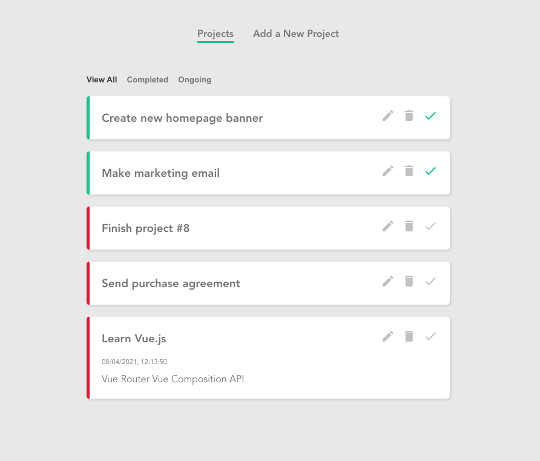
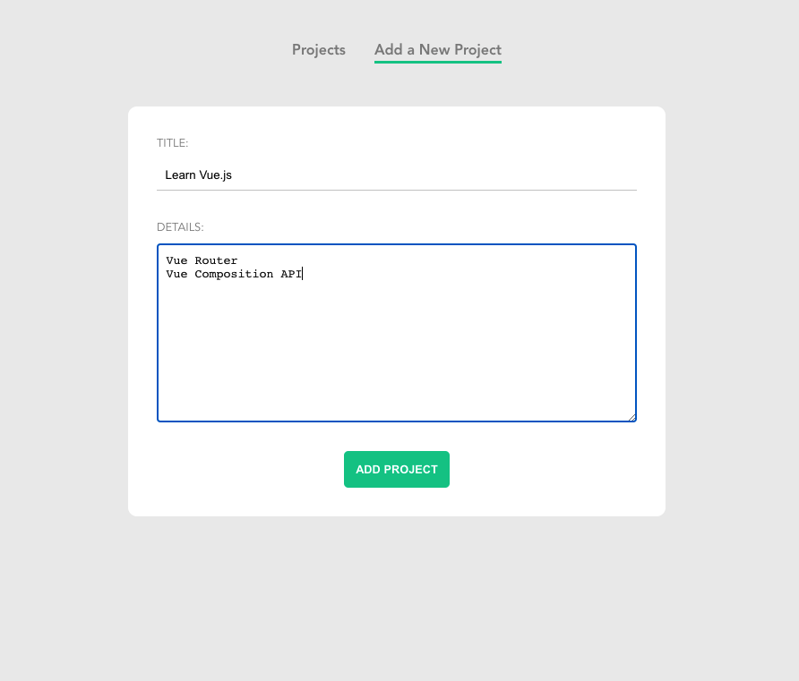

# 7. Project - planner (Vue.js)
## Screenshots

## Features
- Create and new projects (JSON Server)
- Read and list(show) projects
- Edit projects
- Delete projects
- Mark projects as completed
- Filter projects by all, completed and ongoing
- Click on a project to see more details

## Skills
- HTML
- CSS
- JS
- Vue.js
- JSON Server